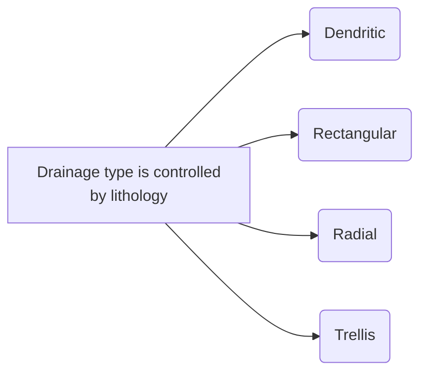
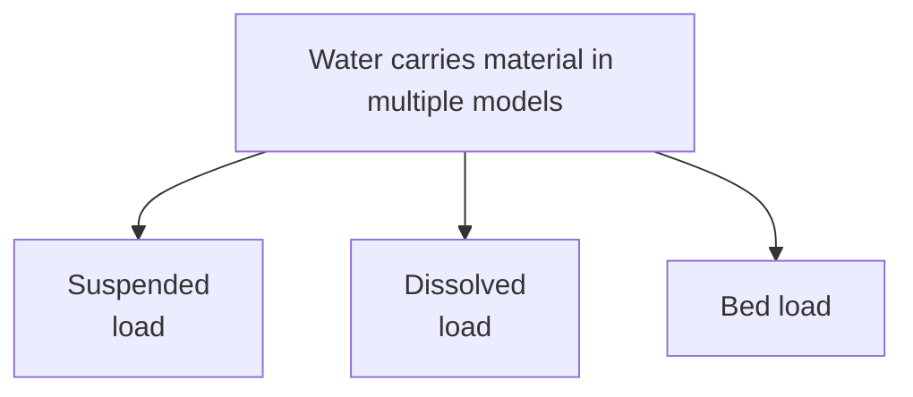

Book Name : 
Date Started : 05-11-2023
Date Finished : 

### Suggested Links 
+ 

### Questions to track 
+ Fluvial landforms 

### Chapters Section 
+ 

The interaction with the fluid too can be very different. The way the basins (water bodies) carry matter carries solid with the fluids is interesting to study

##### Reservoir of Water Beneath the Ground 
Factors influencing the water storage and extraction 
+ Porosity
+ Permeability

Types of reservoir
+ Unconfined aquifer 
	+ water can be stored and extracted
+ Confined aquifer
	+ water can be stored and extracted 
+ Aquitard
	+ water can be stored but can only be partially extracted
+ Aquiclude
	+ water can be stored but cannot be extracted
+ Aquifuge
	+ water cannot be stored and therefore no possibility of extraction