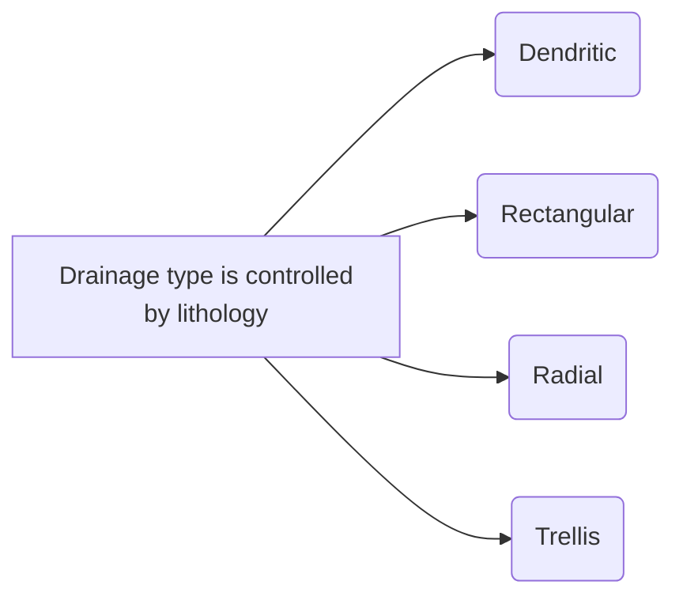
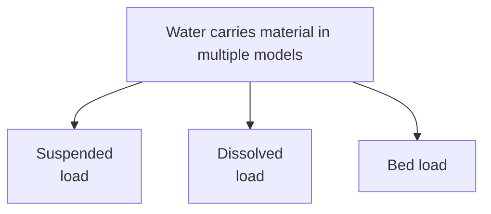

Book Name : 
Date Started : 05-11-2023
Date Finished : 13-11-2023

### Suggested Links 
+ 

### Questions to track 
+ Fluvial landforms 

### Chapters Section 
+ 

The interaction with the fluid too can be very different. The way the basins (water bodies) carry matter carries solid with the fluids is interesting to study

##### Reservoir of Water Beneath the Ground 
Factors influencing the water storage and extraction 
+ Porosity
+ Permeability

Types of reservoir
+ Unconfined aquifer 
	+ water can be stored and extracted
+ Confined aquifer
	+ water can be stored and extracted 
+ Aquitard
	+ water can be stored but can only be partially extracted
+ Aquiclude
	+ water can be stored but cannot be extracted
+ Aquifuge
	+ water cannot be stored and therefore no possibility of extraction

![[Screenshot 2023-11-13 at 2.58.01 PM.png]]

### Sedimentary Rocks

<figure>

<figcaption align = "center">
<b>Some sedimentary rocks acts as a reservoir below the ground in different capacities</b>
</figcaption>

</figure>

  <!-- Replace 'image1.jpg' and 'image2.jpg' with the paths to your images -->
  
  

The above are sedimentary rocks.

- In left (L) is the chalk formation which have extensive fine grained chalk formations deposit in the deep, calm waters
- In the right (R) , is the limestone formation in the desert. It was a sea once. It was photographed in White Desert, Egypt. 

> Giant rocks on the beach are sometimes found. The reasons can be diverse. But the often found reason is subsurface volcanism and subsequent exposure. 

