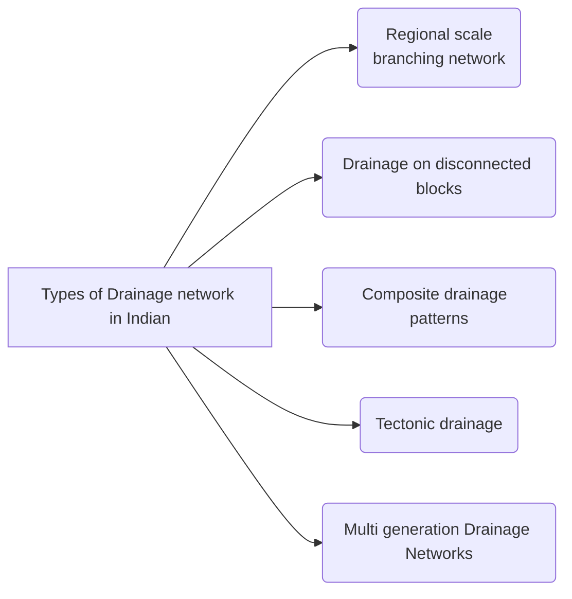
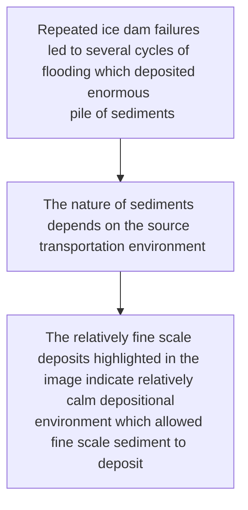

Book Name : 
Date Started : 13-11-2023
Date Finished : 14-11-2023

### Suggested Links 
+ 

### Questions to track 
+ Drainage network on Titan
+ What implications do the mineral dust have on temperature of atmosphere ? 

### Chapters Section 
+ 

## Geological Activity of Water

<figure>

<figcaption align = "center">
<b>Channeled Scablands</b>
</figcaption>

</figure>

$$\Downarrow$$

1. The Cordilleran ice sheet repeatedly advanced to block the Clark Fork River
2. Behind the ice dam, water from the Clark Fork gathered, forming glacial  Lake Missoula
3. Each time the ice dam broke, a torrent of water with 10 times the combined flow of all the world's river barreled through the Spokane River valley.
4. The rushing floodwaters traveled southwest across the Columbian Basin, scouring the bedrock. 
5. Floodwaters converged into the Columbia River Gorge and eventually emptied into the Pacific. 

$$\Downarrow$$
$$\text{Ice age floods carved out channeled scablands}$$

  

#### Wind as a carrier of Dust
1. Planet's radiation budget  $\Longrightarrow$ incoming and outgoing radiation
2. Dust activity 
	- Periodicity
	- Geographic scale
3. Dust may impacts in multiple ways 
	- Opacity of the atmosphere impact navigation
	- Important nutrient for life on land and in ocean
	- Serve as nuclei for cloud formation

