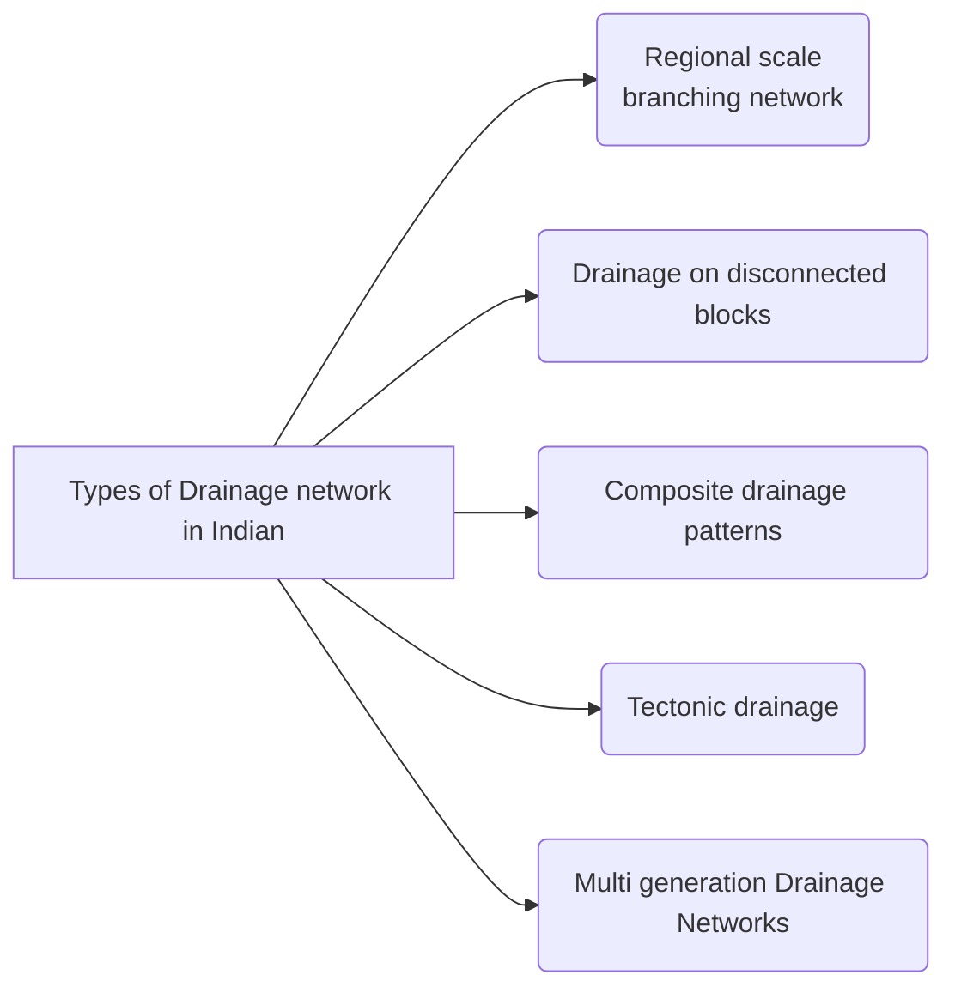

Book Name : 
Date Started : 13-11-2023
Date Finished : 

### Suggested Links 
+ 

### Questions to track 
+ Drainage network on Titan

### Chapters Section 
+ 

## Geological Activity of Water

<figure>

<figcaption align = "center">
<b>Channeled Scablands</b>
</figcaption>

</figure>

$$\Downarrow$$

1. The Cordilleran ice sheet