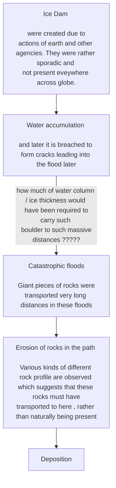
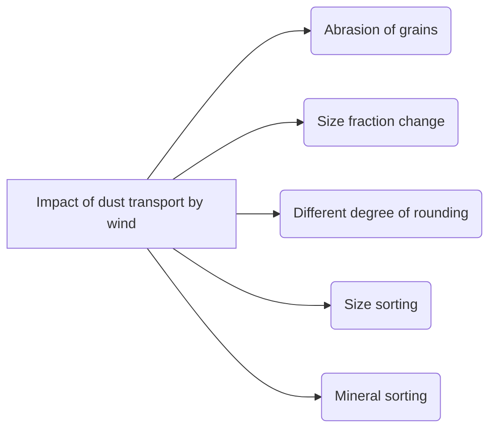

Book Name : 
Date Started : 14-11-2023
Date Finished : 15-11-2023

### Suggested Links 
+ Dry lands, Idaho, USA

### Questions to track 
+ 

### Chapters Section 
+ 

- Large ice age floods happened around ~ 15, 000 years ago 

###### Process which help made Channeled Scablands

> Depositional history can tell us about the nature of floods $\Longrightarrow$ We can study phenomena on other planets taking the analogy of the prior. 

<figure>

<figcaption align = "center">
<b>Fine grained and sorted grains in Missoula while Coarse granied and unsorted grains in Bonneville</b>
</figcaption>

</figure>

> Multiple flooding events bring in sediments of vastly different character 
> - different size fractions
> - different degree of sorting 

##### Channeled scablands resembles with the channeled flows on Mars. 

# Dust Transportation by wind

<figure>

<figcaption align = "center">
<b>Dust deposition on Basaltic Basement -- The Palouse  Loess(wind blown dust) deposits on basalts have made this landscape very fertile</b>
</figcaption>

</figure>

# Transport History of Pebbles on Mars
Martian basalt pebbles have been carried for tens of kilometre from their source, by bed-load transport on an alluvial fan.

<figure>

<figcaption align = "center">
<b>a. Evolution of shape of pebbles on mars b. Simulation of evolution of pebbles in lab using rotating drum c. Example from Earth features  d. Example from non-Earth feature</b>
</figcaption>

</figure>

In the figure above, 
- IR - circularity
- C - convexity
- b/a - axis ratio

1. Shape evolution of a single particle constantly colliding with a flat surface is described by 
$$\bbox[8px, border: 2px solid red] {\tag{Fickey's equation}v = c \times k}$$
where
- $v = \text{speed of abrasion}$
- $c = \text{constant}$
- $k = \text{local curvature}$
2. Rotating Drum experiment : Simulate transportation by tracking number of rotations 